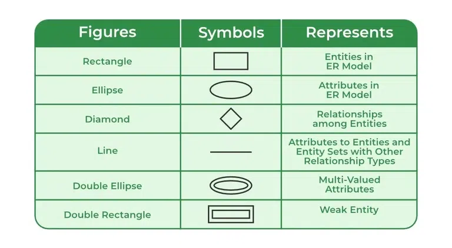

# DBMS

Database Management System (DBMS) is a software system that allows users to define, create, maintain, and control access to databases. It serves as an interface between the database and the end-users or application programs, ensuring efficient and organized management of data.

# key aspects of a DBMS:

1) Data Organization: DBMS organizes data into structured formats, typically tables, rows, and columns, based on predefined schemas. This structured organization allows for efficient storage, retrieval, and manipulation of data.

2) Data Integrity and Security: DBMS ensures data integrity by enforcing constraints and rules defined during database design. It also provides mechanisms for data security, such as access control and encryption, to protect sensitive information from unauthorized access or manipulation.

3) Data Querying and Manipulation: Users can retrieve, update, insert, and delete data from the database using SQL (Structured Query Language) or other query languages supported by the DBMS. These queries allow users to interact with the database and perform various operations on the data.

4) Concurrency Control and Transaction Management: DBMS manages concurrent access to the database by multiple users or applications to ensure data consistency. It employs techniques like locking and timestamp-based concurrency control to handle simultaneous transactions effectively. Additionally, it supports transaction management, enabling users to execute multiple database operations as a single logical unit, ensuring atomicity, consistency, isolation, and durability (ACID properties).

5) Data Backup and Recovery: DBMS provides mechanisms for data backup and recovery to prevent data loss due to hardware failures, system crashes, or human errors. It allows users to create backups of the database at regular intervals and restore the data to a consistent state in case of failures.

6) Data Modeling and Schema Design: Before creating a database, users define its structure and organization using data modeling techniques. DBMS supports various data models, such as relational, hierarchical, network, or object-oriented, allowing users to choose the most suitable model for their requirements. It also assists in schema design, defining the structure, constraints, and relationships of the database entities.

7) Scalability and Performance Optimization: DBMS offers features for scaling databases to accommodate growing data volumes and optimizing performance to ensure efficient data processing. It includes indexing, query optimization, caching, and partitioning techniques to enhance database performance and scalability.

# Data Models

1) Data models provide a structured way to represent and organize data within a database. They define the logical structure of the database and the relationships between different types of data. 

2) Relational Data Model: The relational model organizes data into tables, where each table consists of rows (tuples) and columns (attributes). Relationships between tables are established through keys, such as primary keys and foreign keys. Relational databases, such as MySQL, PostgreSQL, and Oracle, implement this model.

3) Entity-Relationship (ER) Model: The ER model represents entities (objects), attributes of entities, and relationships between entities. Entities are represented as rectangles, attributes as ovals, and relationships as diamonds. This model is commonly used in database design to visualize and specify the structure of a database.

4) Hierarchical Data Model: The hierarchical model organizes data in a tree-like structure, with parent-child relationships between data elements. Each parent can have multiple children, but each child has only one parent. This model was popular in early database systems, such as IMS (Information Management System).

5) Network Data Model: The network model extends the hierarchical model by allowing each child to have multiple parents, creating a more flexible structure. Data is organized into nodes and links, representing entities and relationships between them. This model was popular in the 1960s and 1970s, but it's less commonly used today.

# Database languages

Database languages are specialized programming languages used to interact with databases. They enable users to perform various operations such as querying, updating, and managing data stored in a database.

1) SQL (Structured Query Language):

SQL is a standard language for relational database management systems (RDBMS).
It is used to perform operations like data retrieval (SELECT), data manipulation (INSERT, UPDATE, DELETE), and data definition (CREATE, ALTER, DROP).
SQL is a declarative language, meaning that users specify what they want to retrieve or manipulate rather than how to do it.
Variants of SQL include MySQL, PostgreSQL, SQLite, Oracle SQL, Microsoft SQL Server, and others.

2) PL/SQL (Procedural Language/SQL):

PL/SQL is an extension of SQL used in Oracle databases.
It allows users to write procedural code, including loops, conditionals, and exception handling, within SQL statements.
PL/SQL is often used to create stored procedures, functions, triggers, and packages for database programming and automation.

3) T-SQL (Transact-SQL):

T-SQL is an extension of SQL used in Microsoft SQL Server databases.
It includes additional features such as procedural programming constructs (e.g., IF...ELSE, WHILE loops), error handling, and system functions.
T-SQL is commonly used for database administration, development, and business intelligence tasks.

4) Data Definition Languages (DDL):

DDLs are used to define the structure and organization of a database schema.
They include commands like CREATE TABLE, ALTER TABLE, and DROP TABLE for creating, modifying, and deleting database objects.

5) Data Manipulation Languages (DML):

DMLs are used to manipulate data within a database.
They include commands like SELECT, INSERT, UPDATE, and DELETE for querying, inserting, updating, and deleting data in database tables.

6) Data Control Languages (DCL):

DCLs are used to control access to the database and manage user permissions.
They include commands like GRANT and REVOKE for granting and revoking privileges on database objects.

# Database Administrator

A Database Administrator (DBA) is a professional responsible for the design, implementation, maintenance, and security of an organization's databases. They play a critical role in ensuring that databases run smoothly, efficiently, and securely to meet the needs of the organization. 

1) Database Design and Planning:

Collaborating with stakeholders to understand business requirements and design database schemas that meet those requirements.
Choosing appropriate data models, database platforms, and technologies based on the organization's needs and constraints.
Planning for scalability, performance optimization, and disaster recovery.

2) Database Installation and Configuration:
Installing and configuring database management systems (DBMS) software on servers or cloud platforms.
Setting up database instances, configuring parameters, and allocating resources such as memory, CPU, and storage.
Ensuring proper integration with other systems and applications.

3) Database Security:
Implementing and maintaining security measures to protect databases from unauthorized access, data breaches, and other security threats.
Managing user access and permissions, including role-based access control (RBAC), to ensure that users have appropriate privileges.
Monitoring database activity and auditing logs to detect and respond to security incidents.

4) Data Backup and Recovery:
Developing and implementing backup and recovery strategies to prevent data loss and ensure business continuity.
Scheduling and automating regular backups, including full backups, incremental backups, and transaction log backups.
Testing backup and recovery procedures to verify their effectiveness and reliability.

5) Performance Monitoring and Tuning:
Monitoring database performance metrics such as CPU usage, memory utilization, disk I/O, and query execution times.
Identifying performance bottlenecks and tuning database configurations, indexes, and queries to improve efficiency and response times.
Analyzing and optimizing database schema design and data access patterns.

# Database Users

Database users are individuals or entities who interact with a database system to perform various tasks, such as querying data, updating records, and generating reports. These users can be categorized into different roles based on their responsibilities and permissions within the database environment.

1) End Users:

End users are individuals who directly interact with the database system to retrieve information, input data, or perform transactions.
They may use front-end applications, such as web interfaces or desktop software, to access and manipulate data stored in the database.
Examples of end users include employees entering sales orders, customers browsing products on an e-commerce website, or students accessing their 
grades online.

2) Database Administrators (DBAs):

Database administrators are responsible for managing and maintaining the database system, ensuring its reliability, performance, and security.
They perform tasks such as database design, installation, configuration, backup and recovery, security management, and performance tuning.
DBAs may also be responsible for setting up user accounts, defining access controls, and providing technical support to database users.

3) Database Developers:

Database developers are responsible for designing, implementing, and optimizing database schemas, queries, and stored procedures.
They write SQL queries, create database objects (tables, views, indexes), and develop application code that interacts with the database.
Database developers work closely with software developers, business analysts, and other stakeholders to ensure that database systems meet 

4) application requirements.

Data Analysts and Report Writers:
Data analysts and report writers analyze data stored in the database to derive insights, generate reports, and make data-driven decisions.
They write complex queries, perform data aggregation, visualization, and statistical analysis to extract meaningful information from the database.
Data analysts may use business intelligence (BI) tools, reporting software, or custom scripts to access and analyze data.

5) System Administrators:

System administrators are responsible for managing the underlying infrastructure and resources that support the database system.
They oversee server maintenance, network configuration, security updates, and performance monitoring to ensure the reliability and availability of the database environment.
System administrators may also manage backups, disaster recovery plans, and high-availability solutions to minimize downtime and data loss.

# Three Schema architecture of DBMS

1) Internal Schema

The internal level has an internal schema which describes the physical storage structure of the database.
The internal schema is also known as a physical schema.
It uses the physical data model. It is used to define that how the data will be stored in a block.
The physical level is used to describe complex low-level data structures in detail

2) Conceptual Level

The conceptual schema describes the design of a database at the conceptual level. Conceptual level is also known as logical level.
The conceptual schema describes the structure of the whole database.
The conceptual level describes what data are to be stored in the database and also describes what relationship exists among those data.
In the conceptual level, internal details such as an implementation of the data structure are hidden.
Programmers and database administrators work at this level.

3) External Level

At the external level, a database contains several schemas that sometimes called as subschema. The subschema is used to describe the different view of the database.
An external schema is also known as view schema.
Each view schema describes the database part that a particular user group is interested and hides the remaining database from that user group.
The view schema describes the end user interaction with database systems.

# Hierarchical and Network Data Models:

1) Hierarchical Model

In this model, data is organized in a tree-like structure with parent-child relationships. Each parent can have multiple children, but each child has only one parent. IBM's IMS (Information Management System) is an example of a database system that uses the hierarchical model.

2) Network Model

The network model extends the hierarchical model by allowing each child to have multiple parents, creating a more flexible structure. Data is organized into nodes and links, representing entities and relationships between them. The CODASYL (Conference on Data Systems Languages) standard is a well-known example of the network model.

# Data Independence:

Data independence refers to the ability to change the database schema at one level without affecting the schema at other levels.

1) Logical Data Independence: Changes to the conceptual schema (logical schema) do not require changes to the external schema or application programs. Users and applications remain unaffected by modifications to the logical structure of the database.

2) Physical Data Independence: Changes to the internal schema (physical schema) do not require changes to the conceptual schema or external schema. Modifications to the storage structure, indexing, or data representation do not impact the logical or user views of the data.

# Entity-Relationship (ER) Model

The Entity Relational Model is a model for identifying entities to be represented in the database and representation of how those entities are related. The ER data model specifies enterprise schema that represents the overall logical structure of a database graphically. The Entity Relationship Diagram explains the relationship among the entities present in the database. ER models are used to model real-world objects like a person, a car, or a company and the relation between these real-world objects. 

* Symbols Used in ER Model

* Components of ER Diagram

1) Entity

An Entity may be an object with a physical existence – a particular person, car, house, or employee – or it may be an object with a conceptual existence – a company, a job, or a university course. 

2) Strong Entity

A Strong Entity is a type of entity that has a key Attribute. Strong Entity does not depend on other Entity in the Schema. It has a primary key, that helps in identifying it uniquely, and it is represented by a rectangle. These are called Strong Entity Types.

3) Weak Entity

An Entity type has a key attribute that uniquely identifies each entity in the entity set. But some entity type exists for which key attributes can’t be defined. These are called Weak Entity types. 

# User Data Modeling using Entity Relationship Model

Data modeling using the Entity-Relationship (ER) model is a fundamental technique in database design, where data entities, attributes, and relationships are represented graphically to define the structure and organization of a database. Here's an overview of how data modeling is done using the Entity-Relationship model:

1) dentify Entities:
The first step in data modeling is to identify the main entities (objects or concepts) that need to be represented in the database. Entities typically correspond to real-world objects such as customers, products, orders, employees, etc.

2) Define Attributes:
For each entity, identify and define the attributes (properties or characteristics) that describe the entity. Attributes provide details about the entities and help differentiate one instance of an entity from another.
Example attributes for a "Customer" entity might include Name, Address, Email, Phone Number, etc.

3) Establish Relationships:
Determine the relationships between entities. Relationships represent how entities are related to each other and are typically classified as one-to-one, one-to-many, or many-to-many.
Use verbs or phrases to describe the nature of the relationships between entities. For example, a customer "places" many orders, implying a one-to-many relationship between the "Customer" and "Order" entities.
Relationships are depicted graphically using lines connecting the related entities, with cardinality and optionality indicators to specify the nature of the relationship.

4) Refine the Model:
Refine the model by reviewing and validating the relationships and attributes to ensure they accurately reflect the requirements of the system.
Normalize the data model to eliminate redundancy and ensure data integrity. This involves breaking down the model into smaller, more manageable entities and resolving any many-to-many relationships through the introduction of junction tables.

5) Create ER Diagrams:
ER diagrams are graphical representations of the data model, showing entities as rectangles, attributes as ovals, and relationships as lines connecting entities.
Labels and symbols are used to indicate cardinality (how many instances of one entity are related to another) and optionality (whether a relationship is mandatory or optional).
ER diagrams provide a visual way to communicate the database design to stakeholders, including developers, designers, and end-users.

# converting  ER Model to relational tables.

Converting an Entity-Relationship (ER) model to relational tables involves translating the entities, attributes, and relationships defined in the ER diagram into a set of normalized tables in a relational database management system (RDBMS). Here's a step-by-step process to convert an ER model to relational tables:

1) Identify Entities and Attributes:
Review the ER diagram and identify each entity along with its attributes.
Each entity in the ER model will become a table in the relational database, and each attribute will become a column in the corresponding table.

2) Normalize the Data Model:
Normalize the data model to eliminate redundancy and ensure data integrity.
Apply normalization techniques such as First Normal Form (1NF), Second Normal Form (2NF), and Third Normal Form (3NF) to break down the model into smaller, more manageable tables.
Ensure that each table represents a single entity type and that each attribute is atomic (indivisible) and dependent only on the primary key.

3) Identify Primary Keys:
Determine the primary key for each table, which uniquely identifies each row in the table.
Primary keys can be single attributes or composite keys (combination of multiple attributes).
Ensure that primary keys are unique and not null.

4) Establish Relationships:
Translate the relationships between entities into foreign key constraints in the relational schema.
For one-to-one and one-to-many relationships, include the primary key of the parent entity as a foreign key in the child entity's table.
For many-to-many relationships, create a junction table (also known as an associative table or linking table) to represent the relationship, with foreign keys referencing the participating entities.

5) Define Constraints and Indices:
Define integrity constraints such as foreign key constraints, unique constraints, and check constraints to enforce data consistency and integrity.
Define indices on columns frequently used for querying to improve performance.

# Relational data model concepts

In the relational data model, data is organized into tables, also known as relations, which consist of rows (tuples) and columns (attributes). This model is based on mathematical set theory and provides a logical and efficient way to represent and manipulate data. Here are some key concepts of the relational data model:

1) Tables (Relations):
Tables are the basic structures in the relational data model.
Each table represents a relation, containing rows and columns.
Rows represent individual records or tuples, while columns represent attributes or fields of the records.
Tables have unique names and are organized into schemas, which define the structure and properties of the tables.

2) Attributes (Columns):
Attributes are the characteristics or properties of the entities represented by a table.
Each column in a table corresponds to a single attribute, with a unique name and data type.
Examples of attributes include customer ID, name, age, address, etc.

3) Tuples (Rows):
Tuples are individual records or instances represented by rows in a table.
Each tuple contains values for each attribute defined in the table.
Tuples are unordered, meaning that the order of rows in a table is not significant.

4) Keys:
Keys are attributes or combinations of attributes used to uniquely identify tuples in a table.
Primary Key: A primary key is a unique identifier for each tuple in a table. It ensures that each record in the table is uniquely identifiable.
Foreign Key: A foreign key is an attribute or set of attributes in one table that references the primary key in another table. It establishes relationships between tables by enforcing referential integrity.

5) Domain:
Domain refers to the set of permissible values for each attribute in a table.
Domain constraints define the data type, range, and format of values that can be stored in each column.
Common data types include integers, strings, dates, and floating-point numbers.

6) Constraints:
Constraints are rules or conditions that enforce data integrity and consistency in the database.
Entity Integrity Constraint: Ensures that each tuple in a table has a unique primary key value and that primary key values are not null.
Referential Integrity Constraint: Ensures that relationships between tables are maintained. It ensures that foreign key values in one table match primary key values in another table.

# Concept of keys

1) Primary Key:
A primary key is a unique identifier for each record (tuple) in a table.
It ensures that each row in the table is uniquely identifiable.
Primary keys can be composed of one or more columns (composite keys), but the combination of values must be unique for each tuple.
Primary keys are defined when creating a table and are often implemented using constraints to enforce uniqueness and non-null values.
Example: In a "Students" table, a column named "StudentID" could serve as the primary key.

2) Foreign Key:
A foreign key is a column or set of columns in one table that references the primary key in another table.
It establishes a relationship between the tables, known as a referential integrity constraint.
Foreign keys enforce data consistency by ensuring that values in the referencing column(s) exist in the referenced table's primary key column(s).
Example: In a "Orders" table, a column named "CustomerID" might serve as a foreign key that references the "CustomerID" primary key in a "Customers" table.

3) Unique Key:
A unique key ensures that the values in one or more columns are unique across all rows in a table.
Unlike a primary key, a unique key can allow null values.
Unique keys are used to enforce data integrity when there is a requirement for uniqueness but not for the column(s) to be the primary key.
Example: A "Username" column in a "Users" table could have a unique key constraint to ensure that each username is unique.

4) Composite Key:
A composite key consists of multiple columns that, together, uniquely identify each row in a table.
It is used when no single column can uniquely identify a row, but the combination of values in multiple columns does.
Composite keys are often used when representing complex relationships or when a natural key is not available.

#  Mapping Constraints

Mapping constraints, also known as referential integrity constraints, are rules that define and enforce relationships between tables in a relational database. These constraints ensure that data remains consistent and accurate across related tables by enforcing rules about how data can be inserted, updated, or deleted.

1) Primary Key Constraint:
This constraint ensures that the values in a specific column (or combination of columns) are unique and not null.
It is used to define the primary key of a table, which uniquely identifies each record in the table.
Example: In a "Students" table, the "StudentID" column could be defined as the primary key.

2) Foreign Key Constraint:
This constraint establishes a relationship between two tables by linking a column (or combination of columns) in one table to the primary key column(s) in another table.
It ensures referential integrity by enforcing that the values in the foreign key column(s) exist in the referenced primary key column(s) of the 
related table.
Example: In an "Orders" table, the "CustomerID" column could be a foreign key that references the "CustomerID" primary key column in a "Customers" table.

3) Unique Constraint:
This constraint ensures that the values in a specific column (or combination of columns) are unique across all records in a table.
Unlike a primary key constraint, a unique constraint allows null values.
It is used to enforce uniqueness when there is a requirement for uniqueness but the column(s) are not suitable for defining the primary key.
Example: A "Username" column in a "Users" table could have a unique constraint to ensure that each username is unique.

4) Check Constraint:
This constraint defines a condition that must be satisfied for the values in a column.
It is used to enforce domain integrity by limiting the range of acceptable values for a column.
Example: In a "Employees" table, a check constraint could ensure that the "Age" column contains values greater than or equal to 18.

# Null Values

A null value represents the absence of a value or an unknown value in a database column.
Null values are different from zero, empty strings, or spaces; they indicate the absence of any data.
Null values are allowed in columns even if they have constraints like NOT NULL, which means that a column must have a value. However, a column with a NOT NULL constraint cannot have null values.
Null values can occur for various reasons, such as missing or incomplete information, optional attributes, or data that hasn't been collected yet.
When working with null values, it's essential to handle them appropriately to prevent unexpected behavior and ensure data consistency and accuracy.
Some database operations treat null values differently, so it's crucial to understand how nulls are handled in your database system.

# Domain Constraints

Domain constraints define the permissible values for a column in a database table.
They specify the data type, format, range, or set of values that a column can contain.
Domain constraints help enforce data integrity by ensuring that only valid and meaningful data is stored in the database.
Common types of domain constraints include:
Data type constraints: Specify the type of data allowed in a column (e.g., integer, string, date).
Range constraints: Define the allowable range of values for a numeric or date column.
Format constraints: Specify the format or pattern that data must adhere to (e.g., email addresses, phone numbers).
Set constraints: Define a list of allowed values for a column (e.g., a column representing a gender field may only allow values like 'M' or 'F').
Domain constraints are typically enforced using column data types, check constraints, and foreign key constraints.

# Referential Integrity Constraints

Referential integrity constraints are rules that enforce the relationships between tables in a relational database. These constraints ensure that relationships between tables remain consistent and valid, preventing actions that could compromise the integrity of the data. The primary goal of referential integrity constraints is to maintain data consistency and accuracy across related tables.

1) Primary Key Constraint:
The primary key constraint ensures that each row in a table is uniquely identified by a primary key.
It prevents duplicate or null values in the primary key column(s) of a table.
Primary keys are used to uniquely identify rows in a table and are referenced by foreign keys in related tables.

2) Foreign Key Constraint:
The foreign key constraint establishes a relationship between two tables by linking a column (or set of columns) in one table to the primary key column(s) in another table.
It ensures that values in the foreign key column(s) of a child table match values in the primary key column(s) of the parent table.
Foreign key constraints enforce referential integrity by preventing actions that would violate the defined relationships, such as inserting values that do not exist in the referenced table or deleting rows referenced by foreign keys.

3) Cascade Actions:
Cascade actions define what should happen to related rows in child tables when a corresponding row in a parent table is updated or deleted.

# Unary Relational Operations

* SELECT:

In relational algebra, the SELECT operation (σ) is used to retrieve rows from a relation (table) that satisfy a specified condition.
The condition is typically expressed as a logical predicate involving one or more attributes of the relation.
Example: σ(Age > 18)(Students) retrieves all rows from the "Students" relation where the age is greater than 18.

* PROJECT:

The PROJECT operation (π) is used to select a subset of columns (attributes) from a relation.
It eliminates duplicate rows from the result.
Example: π(Name, Age)(Students) selects only the "Name" and "Age" attributes from the "Students" relation, eliminating duplicate rows.

# Binary Relational Operations

* JOIN:

The JOIN operation is used to combine rows from two relations based on a related attribute (or set of attributes).
Different types of joins include INNER JOIN, LEFT JOIN, RIGHT JOIN, and FULL JOIN, each with its own rules for combining rows.

Example (SQL):
SELECT Orders.OrderID, Customers.CustomerName
FROM Orders
INNER JOIN Customers ON Orders.CustomerID = Customers.CustomerID;
This SQL query performs an INNER JOIN between the "Orders" and "Customers" tables based on the "CustomerID" column.

* DIVISION:

The DIVISION operation is less commonly used and represents a more complex operation in relational algebra.
It is used to find all tuples in one relation that are associated with all tuples in another relation.
Example: R ÷ S returns all tuples from relation R for which there are matching tuples in S for every tuple in R.

* SQL:

SQL (Structured Query Language) is a standard language for managing relational databases.
It provides a set of commands for defining, querying, updating, and managing data in relational database systems.
SQL supports all the relational operations mentioned above, including SELECT, PROJECT, JOIN, and DIVISION, as well as additional operations like INSERT, UPDATE, DELETE, and CREATE.

Example (SQL SELECT statement):
SELECT * FROM Students WHERE Age > 18;
This SQL query retrieves all columns from the "Students" table where the age is greater than 18.
